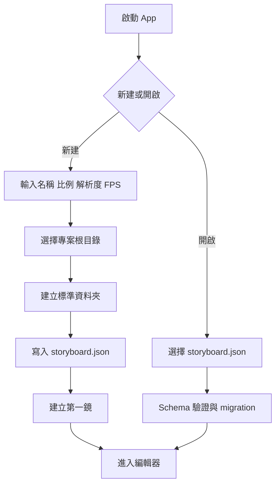
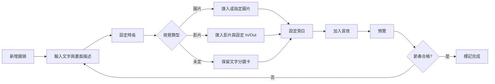
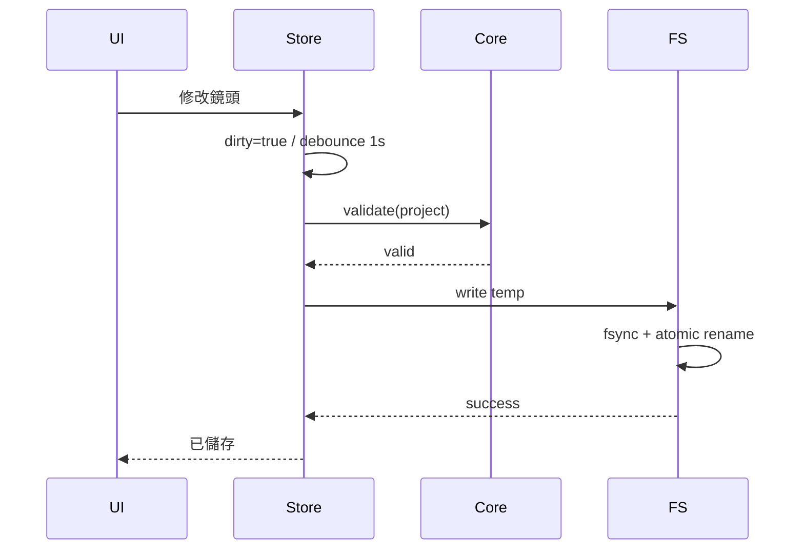

# 完整流程設計

## 新建專案流程

## 單鏡製作流程

## 預覽流程

1. 由所有 enabled shots 建立累積時間表。
2. 播放頭時間映射到鏡頭與鏡內 offset。
3. 載入視覺素材；若缺失則顯示 fallback。
4. 依 narration offset 排程旁白。
5. 排程鏡頭內音效。
6. 到達鏡頭末端時套用轉場並切換下一鏡。
7. 播放完成後停在最後一格。

## 素材匯入流程

1. 使用者選擇外部檔案。
2. App 偵測類型、大小、雜湊與 metadata。
3. 顯示「複製到專案」或「只連結」選項。
4. 預設複製到對應資料夾，避免外部路徑失效。
5. 同名檔使用 `name_001.ext`，不直接覆蓋。
6. JSON 僅保存相對路徑。
7. 產生縮圖或 waveform cache，cache 可安全重建。

## 自動儲存與恢復

## 匯出流程

1. Validate project。
2. 掃描素材存在性與時長衝突。
3. 顯示匯出前檢查報告。
4. 使用者選擇輸出類型與資料夾。
5. 產生新檔，不自動覆蓋。
6. 寫入 export manifest，記錄版本與來源專案 hash。
